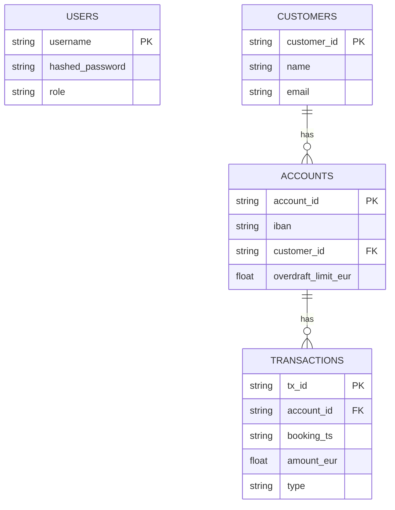

# Data Model Diagram

## Transaction Types

| Type | Description |
|---|---|
| `TRANSFER_OUT` | Debit leg of an internal transfer |
| `TRANSFER_IN` | Credit leg of an internal transfer |
| `FEE_REVERSAL` | Manual fee reversal (BACKOFFICE only) |
| `MANUAL_ADJ` | Manual adjustment (BACKOFFICE only) |
