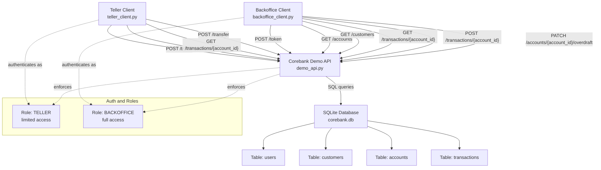

# System Components Diagram

```mermaid
graph TD
    A["Teller Client\nteller_client.py"] -->|"POST /token"| C["Corebank Demo API\ndemo_api.py"]
    A -->|"GET /accounts"| C
    A -->|"GET /transactions/{account_id}"| C
    A -->|"POST /transfer"| C

    B["Backoffice Client\nbackoffice_client.py"] -->|"POST /token"| C
    B -->|"GET /accounts"| C
    B -->|"GET /customers"| C
    B -->|"GET /transactions/{account_id}"| C
    B -->|"POST /transactions/{account_id}"| C
    B -->|"PATCH /accounts/{account_id}/overdraft"| C

    C -->|"SQL queries"| D["SQLite Database\ncorebank.db"]

    D --> T1["Table: users"]
    D --> T2["Table: customers"]
    D --> T3["Table: accounts"]
    D --> T4["Table: transactions"]

    subgraph "Auth and Roles"
        R1["Role: TELLER\nlimited access"]
        R2["Role: BACKOFFICE\nfull access"]
    end

    A -.->|"authenticates as"| R1
    B -.->|"authenticates as"| R2
    C -.->|"enforces"| R1
    C -.->|"enforces"| R2
```
